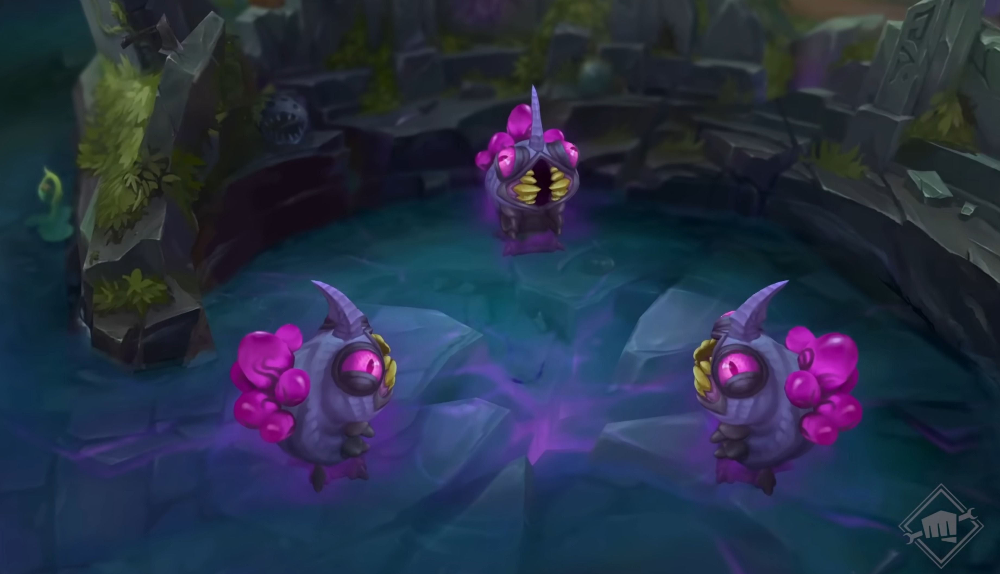

# Analysis of Void Grubs in League of Legends (Pro Play 2024)

## Introduction
 

(Image source: Riot Games)

In January 2024, the video game **League of Legends** (LoL) moved to Season 14. Each season brings new changes to the competitive metagame, such as item reworks, map modifications, balance changes, and new objectives to obtain each game. One of the new objectives to be added this season is known as [**void grubs**](https://leagueoflegends.fandom.com/wiki/Voidgrub_camp). As of patch 14.6, 3 grubs spawn at the 5:00 minute mark, then another 3 spawn 4 minutes after the first grub camp is taken. Each grub taken grants extra damage to towers to the team that takes them. Grabbing 5 or 6 grubs will spawn 1 or 2 [**void mites**](https://leagueoflegends.fandom.com/wiki/Voidgrub_camp#Voidmite) respectively when hitting towers, which are especially useful in building large pushes.

However, void grubs spawn on the opposite side of the map as [dragons](https://leagueoflegends.fandom.com/wiki/Dragon_pit_(League_of_Legends)), another game-defining objective. Furthermore, grubs require a lot of time to complete, often requiring help from other teammates to defend their jungler as they take the grubs. Therefore, understanding the impact of prioritizing or a*void*ing grubs is incredibly important in mastering the game. As a jungle main myself, I am curious to see the effect of the new objective on the metagame. Specifically,

**What effect does obtaining grubs have on the outcome of the match?**

---

This dataset from [Oracle's Elixir](https://oracleselixir.com/tools/downloads) contains all professional matches played in 2024 so far, including players and team results. The description of the relevant columns are:
- `league`: which professional league the match was played in
- `teamname`: name of the professional team
- `result`: the result of the game. `1` means a win, while `0` means a loss.
- `playoffs`: whether or not the game was played during playoffs. `1` means yes, while `0` means no.
- `void_grubs`: the number of void grubs taken by that team
- `opp_void_grubs`: the number of void grubs taken by the opposing team
- `heralds`: whether or not a team took the [rift herald](https://leagueoflegends.fandom.com/wiki/Rift_Herald/LoL). `1` means the team obtained the rift herald, `0` means they did not.

## Data Cleaning and EDA

First, the dataset was split into two new datasets, one having information about the players, and one having information about the overall outcome of the match. Some rows had matches played in 2024 were played in patches before 14.01; these were all removed, as void grubs only exist in patch 14.01 and beyond. 

Some rows had matches where their `datacompleteness` was not `complete` (marked `partial`), so they did not have complete information on the number of void grubs that were taken. These rows were removed as well. Additionally, a column called `majority_grubs` was added to denote if a team was able to take 4 or more grubs.

<table border="1" class="dataframe">
  <thead>
    <tr style="text-align: right;">
      <th></th>
      <th>gameid</th>
      <th>league</th>
      <th>split</th>
      <th>patch</th>
      <th>teamname</th>
      <th>result</th>
      <th>void_grubs</th>
      <th>opp_void_grubs</th>
      <th>playoffs</th>
      <th>heralds</th>
      <th>majority_grubs</th>
    </tr>
  </thead>
  <tbody>
    <tr>
      <th>226</th>
      <td>LOLTMNT06_13630</td>
      <td>LEC</td>
      <td>Winter</td>
      <td>14.01</td>
      <td>Team BDS</td>
      <td>0</td>
      <td>6.0</td>
      <td>0.0</td>
      <td>0</td>
      <td>0.0</td>
      <td>True</td>
    </tr>
    <tr>
      <th>227</th>
      <td>LOLTMNT06_13630</td>
      <td>LEC</td>
      <td>Winter</td>
      <td>14.01</td>
      <td>G2 Esports</td>
      <td>1</td>
      <td>0.0</td>
      <td>6.0</td>
      <td>0</td>
      <td>1.0</td>
      <td>False</td>
    </tr>
    <tr>
      <th>238</th>
      <td>LOLTMNT06_12701</td>
      <td>LEC</td>
      <td>Winter</td>
      <td>14.01</td>
      <td>Rogue</td>
      <td>0</td>
      <td>5.0</td>
      <td>1.0</td>
      <td>0</td>
      <td>0.0</td>
      <td>True</td>
    </tr>
    <tr>
      <th>239</th>
      <td>LOLTMNT06_12701</td>
      <td>LEC</td>
      <td>Winter</td>
      <td>14.01</td>
      <td>SK Gaming</td>
      <td>1</td>
      <td>1.0</td>
      <td>5.0</td>
      <td>0</td>
      <td>1.0</td>
      <td>False</td>
    </tr>
    <tr>
      <th>250</th>
      <td>LOLTMNT06_13667</td>
      <td>LEC</td>
      <td>Winter</td>
      <td>14.01</td>
      <td>Karmine Corp</td>
      <td>0</td>
      <td>3.0</td>
      <td>3.0</td>
      <td>0</td>
      <td>0.0</td>
      <td>False</td>
    </tr>
  </tbody>
</table>

### Univariate Analysis

<iframe
  src="assets/uni.html"
  width="800"
  height="600"
  frameborder="0"
></iframe>

This histogram shows the distribution of void grubs taken. `count` refers to the number of matches in which that number of grubs was observed. Surprisingly, 0 grubs taken was the most common number of grubs taken. 3 grubs taken being the second most common amount makes sense, as whoever makes it to grubs first can take all 3 grubs before the other team notices.

### Bivariate Analysis

<iframe
  src="assets/bi1.html"
  width="800"
  height="600"
  frameborder="0"
></iframe>

This box plot shows the distribution of grubs taken for each result. Expectedly, teams that lose their match have a noticeably lower distribution of grubs taken than teams that win.

<iframe
  src="assets/bi2.html"
  width="800"
  height="600"
  frameborder="0"
></iframe>

This bar plot depicts the total number of grubs collected in the regular season of the LCS Spring split, the North American professional LoL league. The final rankings from the regular season are: 
1. FlyQuest (10W - 4L)
1. 100 Thieves (10W - 4L)
3. Cloud9 (8W - 6L)
4. Team Liquid (7W - 7W)
5. Dignitas (6W - 8L)
5. NRG Kia (6W - 8L)
7. Shopify Rebellion (5W - 9L)
8. Immortals (4W - 10L)

Note: Tiebreakers were played but are not included in the summation of grubs for this bar plot. 

The total number of grubs taken does show some correlation with the final standing; however, there are a few noticeable outliers. For instance, Cloud9 took the most grubs, but came in 3rd place. Immortals had the 4th-highest number of grubs, but came in last. On the flip side, 100 Thieves had the second-least grubs, but came in second overall. 

<iframe
  src="assets/bi3.html"
  width="800"
  height="600"
  frameborder="0"
></iframe>

Lastly, this plot shows the distribution of number of grubs and if each team obtained the rift herald or not. Compared to the results plot, the distribution of grubs for teams that did not get the rift herald end up being lower. 

### Aggregate Statistics
<table border="1" class="dataframe">
  <thead>
    <tr style="text-align: right;">
      <th></th>
      <th>mean</th>
      <th>median</th>
      <th>min</th>
      <th>max</th>
    </tr>
    <tr>
      <th>result</th>
      <th></th>
      <th></th>
      <th></th>
      <th></th>
    </tr>
  </thead>
  <tbody>
    <tr>
      <th>0</th>
      <td>2.450972</td>
      <td>2.0</td>
      <td>0.0</td>
      <td>6.0</td>
    </tr>
    <tr>
      <th>1</th>
      <td>2.806261</td>
      <td>3.0</td>
      <td>0.0</td>
      <td>6.0</td>
    </tr>
  </tbody>
</table>

As shown in this table, teams that lose their match tend to have less grubs than teams that win their match. However, losing all 6 grubs is not an immediate death sentence, as teams can still win without getting any of them. Likewise, getting all 6 grubs is not a guaranteed win.

## Assessment of Missingness

For this dataset as a whole, it's unlikely there are columns that are NMAR. There are plenty of null values, but it is due to the design of the dataset itself; since this dataset has information on both players and matches, some columns like `pick1` or `firstbaron` have plenty of missing values for each player. Furthermore, some leagues don't collect data on aspects of the matches at all, hence the `datacompleteness` column.

There are a few matches outside the `partial` category that have the number of grubs missing. It's likely that these missing values are Missing at Random (MAR), as this only happened to select teams, and no grubs being taken is clearly denoted as a `0` in the dataset (so it's not Missing by Design or Not Missing at Random). Let's see if they depend on the team that is playing, or are randomly distributed. For this permutation test, total variation distance is used as the test statistic.

<table border="1" class="dataframe">
  <thead>
    <tr style="text-align: right;">
      <th>grubs_missing</th>
      <th>False</th>
      <th>True</th>
    </tr>
    <tr>
      <th>league</th>
      <th></th>
      <th></th>
    </tr>
  </thead>
  <tbody>
    <tr>
      <th>AL</th>
      <td>0.021987</td>
      <td>0.017001</td>
    </tr>
    <tr>
      <th>CBLOL</th>
      <td>0.037209</td>
      <td>0.028771</td>
    </tr>
    <tr>
      <th>CBLOLA</th>
      <td>0.034672</td>
      <td>0.026810</td>
    </tr>
    <tr>
      <th>DCup</th>
      <td>0.000000</td>
      <td>0.007062</td>
    </tr>
    <tr>
      <th>EBL</th>
      <td>0.027907</td>
      <td>0.021578</td>
    </tr>
    <tr>
      <th>ESLOL</th>
      <td>0.027907</td>
      <td>0.021578</td>
    </tr>
    <tr>
      <th>GLL</th>
      <td>0.026638</td>
      <td>0.020598</td>
    </tr>
    <tr>
      <th>HC</th>
      <td>0.011416</td>
      <td>0.008828</td>
    </tr>
    <tr>
      <th>HM</th>
      <td>0.025793</td>
      <td>0.019944</td>
    </tr>
    <tr>
      <th>LCK</th>
      <td>0.079915</td>
      <td>0.061793</td>
    </tr>
    <tr>
      <th>LCKC</th>
      <td>0.088372</td>
      <td>0.068332</td>
    </tr>
    <tr>
      <th>LCO</th>
      <td>0.030021</td>
      <td>0.023213</td>
    </tr>
    <tr>
      <th>LCS</th>
      <td>0.030444</td>
      <td>0.023540</td>
    </tr>
    <tr>
      <th>LDL</th>
      <td>0.000000</td>
      <td>0.107500</td>
    </tr>
    <tr>
      <th>LEC</th>
      <td>0.048626</td>
      <td>0.037599</td>
    </tr>
    <tr>
      <th>LFL</th>
      <td>0.039746</td>
      <td>0.030733</td>
    </tr>
    <tr>
      <th>LFL2</th>
      <td>0.013953</td>
      <td>0.010789</td>
    </tr>
    <tr>
      <th>LIT</th>
      <td>0.027061</td>
      <td>0.020925</td>
    </tr>
    <tr>
      <th>LJL</th>
      <td>0.030867</td>
      <td>0.023867</td>
    </tr>
    <tr>
      <th>LLA</th>
      <td>0.045243</td>
      <td>0.034983</td>
    </tr>
    <tr>
      <th>LPL</th>
      <td>0.000000</td>
      <td>0.112208</td>
    </tr>
    <tr>
      <th>LPLOL</th>
      <td>0.025793</td>
      <td>0.019944</td>
    </tr>
    <tr>
      <th>LVP SL</th>
      <td>0.041438</td>
      <td>0.032041</td>
    </tr>
    <tr>
      <th>NACL</th>
      <td>0.054968</td>
      <td>0.042503</td>
    </tr>
    <tr>
      <th>NEXO</th>
      <td>0.010994</td>
      <td>0.008501</td>
    </tr>
    <tr>
      <th>NLC</th>
      <td>0.027907</td>
      <td>0.021578</td>
    </tr>
    <tr>
      <th>PCS</th>
      <td>0.051163</td>
      <td>0.039561</td>
    </tr>
    <tr>
      <th>PRM</th>
      <td>0.039746</td>
      <td>0.030733</td>
    </tr>
    <tr>
      <th>TCL</th>
      <td>0.027484</td>
      <td>0.021252</td>
    </tr>
    <tr>
      <th>UL</th>
      <td>0.028753</td>
      <td>0.022232</td>
    </tr>
    <tr>
      <th>VCS</th>
      <td>0.043975</td>
      <td>0.034002</td>
    </tr>
  </tbody>
</table>

- Null Hypothesis: The missingness of `void_grubs` does not depend on `league`.
- Alternative Hypothesis: The missingness of `void_grubs` does depend on `league`.

<iframe
  src="assets/mis1.html"
  width="800"
  height="600"
  frameborder="0"
></iframe>

**p-value = 0.0**

Here, we reject the null hypothesis and conclude that the missingness of `void_grubs` does depend on `league`.

Now, let's see if `result` has any effect:

- Null Hypothesis: The missingness of `void_grubs` does not depend on `result`.
- Alternative Hypothesis: The missingness of `void_grubs` does depend on `result`.

<iframe
  src="assets/mis2.html"
  width="800"
  height="600"
  frameborder="0"
></iframe>

**p-value = 0.992**

Here, we fail to reject the null hypothesis and do not conclude that the missingness of `void_grubs` depends on `result`.

## Hypothesis Testing
Next, let's see if teams with a majority of grubs are able to obtain the herald. In theory, teams that grab a majority of grubs tend to want to play towards the top side of the map, which has the herald as an objective. Also, LoL is a snowball-y game, meaning teams that are in a winning position tend to stay in a winning position and increase their dominance on the map.

- Null Hypothesis: Teams with 4+ grubs have an equal proportion of heralds to teams with less than 4 grubs.
- Alternative Hypothesis: Teams with 4+ grubs have an greater proportion of heralds to teams with less than 4 grubs.

<iframe
  src="assets/hyp1.html"
  width="800"
  height="600"
  frameborder="0"
></iframe>

**p-value = 0.0**

Here, we reject the null hypothesis and accept that teams with 4+ grubs tend to get herald.

## Framing a Prediction Problem

Finally, it can be interesting to predict which team will end up getting more grubs in professional play. Some players have defined playstyles in which they prioritize grubs over other players. Some champions can take grubs quicker, while others can move to support their jungler faster. 

Prediction Problem: How many grubs will a team get based on information before the game begins?

For this problem, the "time of prediction" is right after champion draft. Thus, statistics like 15-minute gold difference or outcome of the match are not considered; it wouldn't make sense to predict if a team gets grubs after grubs are taken.

This prediction problem is a multiclass classification problem. While it can be treated like a regression problem due to the numerical nature of the number of void grubs variable, ultimately the problem lies in classifying a team to a specific, quantized number of grubs. The metric being used to evaluate the model is accuracy. Since the goal of the prediction is to predict correctly as much as possible, accuracy is a fair metric over other metrics.

## Baseline Model

To begin, let's see if the jungle player and their champion is a good predictor of the amount of grubs they will get. In theory, the team's jungler would have an effect on how many grubs are obtained.

This first model utilizes a Linear Regression (with rounded results to properly classify) to predict the amount of grubs a team gets. The model encodes the team jungler's `playername` and `champion` using OneHotEncoder.

With this model, an accuracy of 0.1762 was obtained. This accuracy is not great, almost amounting to random guesses.

## Final Model

To improve the model, features about the whole team is added. As much as solo queue players may beg to differ, LoL is a team game, and the jungler's movements and decisions are greatly affected by their teammates.

This model utilizes a Decision Tree Classifier to predict the amount of grubs a team gets. This model takes a set of data, and "splits" them into separate nodes based on different categorizers, until the maximum depth is achieved. The model encodes the `teamname`, and `pos_champion` of each role using OneHotEncoder. The jungler's `playername` was dropped for being redundant, assuming only one jungler plays for each team.

With this model, an accuracy of 0.272 was obtained. This accuracy is still not great, but is an improvement to the baseline. The best parameters found for this model were `entropy` for its `criterion` and a `max_depth` of `5`.

## Fairness Analysis

To conclude, a fairness analysis was conducted on the final model. The two groups that were compared are the LCS league and the LCK league to see if the model differs between regions. Accuracy was chosen again as the metric of choice, and the test statistic is the difference in accuracy between the LCS and the LCK.

- Null Hypothesis: Our model is fair. Its accuracy between the LCS and the LCK should be similar, and any differences are due to random chance.
- Alternative Hypothesis: Our model is unfair. Its accuracy for the LCS is higher than the LCK.

<iframe
  src="assets/accuracy.html"
  width="800"
  height="600"
  frameborder="0"
></iframe>

**p-value = 0.192**

The p-value is greater than 0.05. Therefore, we fail to reject the null hypothesis and cannot conclude that the LCS has a higher accuracy than the LCK.
